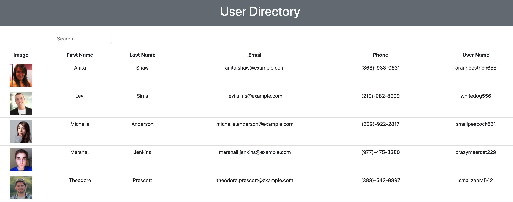

  [](https://opensource.org/licenses/MIT)

    Author: Tomasz Siemion
    Link: https://github.com/rotosti/user-directory
    Deploy Link: https://rotosti.github.io/user-directory/

  ## Screen Cap



  ## Description

  A simple React based user directory with dynamic search and sorting.

  ## Table of Contents

  - [Installation](#installation)
  - [Usage](#usage)
  - [License](#license)
  - [Contributing](#contributing)
  - [Tests](#tests)
  - [Questions](#questions)

  ## Installation

  Run the following command:

  ```bash
  npm i
  ```

  ## Usage

  The appliaction uses an API to gather users.  It is interactive with sorting and searching.

  ## License

  Copyright 2021

        Permission is hereby granted, free of charge, to any person obtaining a copy of this software and associated documentation files (the "Software"), to deal in the Software without restriction, including without limitation the rights to use, copy, modify, merge, publish, distribute, sublicense, and/or sell copies of the Software, and to permit persons to whom the Software is furnished to do so, subject to the following conditions:
        
        The above copyright notice and this permission notice shall be included in all copies or substantial portions of the Software.
        
        THE SOFTWARE IS PROVIDED "AS IS", WITHOUT WARRANTY OF ANY KIND, EXPRESS OR IMPLIED, INCLUDING BUT NOT LIMITED TO THE WARRANTIES OF MERCHANTABILITY, FITNESS FOR A PARTICULAR PURPOSE AND NONINFRINGEMENT. IN NO EVENT SHALL THE AUTHORS OR COPYRIGHT HOLDERS BE LIABLE FOR ANY CLAIM, DAMAGES OR OTHER LIABILITY, WHETHER IN AN ACTION OF CONTRACT, TORT OR OTHERWISE, ARISING FROM, OUT OF OR IN CONNECTION WITH THE SOFTWARE OR THE USE OR OTHER DEALINGS IN THE SOFTWARE.
        
        
  [MIT License](https://www.mit.edu/~amini/LICENSE.md)

  ## Contributing

  I am the sole contributor.

  ## Tests

  No tests currently available
  

  ## Questions

  If you have any questions, comments, concerns, or bug related discoveries,
  you can contact me directly at tsiemion07@gmail.com.  You can also go to my
  [Github](https://github.com/rotosti) to view additional repositories.